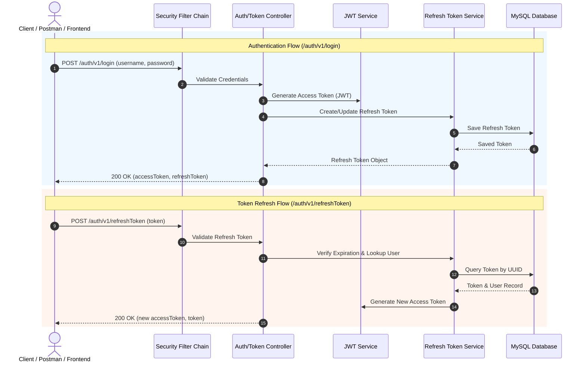

# Expense Tracker - Authentication Service (`AuthService`)

[](https://spring.io/projects/spring-boot)
[](https://www.oracle.com/java/)
[](https://spring.io/projects/spring-security)
[](https://www.mysql.com/)

A robust, microservice-ready **Authentication and Authorization Service** for the Expense Tracker application. Built with **Spring Boot 3.4**, **Spring Security**, **JJWT (JSON Web Token)**, and **Spring Data JPA**, this service manages user credentials, handles secure user registration and login, issues JWT access tokens, and manages refresh token lifecycles with MySQL persistence.

---

## 🚀 Features

- 🔐 **User Registration (`/signup`)**: Secure user onboarding with BCrypt password hashing and automatic role binding.
- 🔑 **User Authentication (`/login`)**: Validates credentials and returns a short-lived **JWT Access Token** alongside a **Refresh Token**.
- 🔄 **Refresh Token Rotation (`/refreshToken`)**: Issues new access tokens using valid, unexpired refresh tokens without requiring re-login.
- 🛡️ **Stateless JWT Security**: Custom `JWTAuthFilter` intercepts protected requests and validates JWT claims on every incoming call.
- 🗄️ **Persistent Token Management**: Automatic token refresh management that updates and reuses active user refresh tokens cleanly in MySQL.

---

## 🛠️ Technology Stack

| Component | Technology | Description |
| :--- | :--- | :--- |
| **Language** | Java 21 | Modern Java version with strong typing and performance |
| **Framework** | Spring Boot 3.4.3 | Core backend web framework |
| **Security** | Spring Security | Fine-grained security filter chain & authentication manager |
| **Tokens** | JJWT (`0.13.0`) | JWT generation, signing (HS256), and claims validation |
| **Persistence** | Spring Data JPA / Hibernate | ORM mapping and repository interfaces |
| **Database** | MySQL 8.x | Relational storage for users, roles, and tokens |
| **Build Tool** | Gradle | Dependency management and build automation |
| **Boilerplate** | Lombok | Auto-generated getters, setters, builders, and constructors |

---

## 📐 System Architecture



---

## 📁 Project Directory Structure

```
AuthService/
├── app/
│   ├── build.gradle
│   └── src/
│       ├── main/
│       │   ├── java/org/example/
│       │   │   ├── App.java                   # Main Spring Boot application entry point
│       │   │   ├── auth/                      # Security configuration & JWT Filters
│       │   │   │   ├── JWTAuthFilter.java     # Per-request JWT authentication filter
│       │   │   │   └── SecurityConfig.java    # Spring Security filter chain configuration
│       │   │   ├── controllers/               # REST API Endpoints
│       │   │   │   ├── AuthController.java    # Registration endpoints
│       │   │   │   └── TokenController.java   # Login & token refresh endpoints
│       │   │   ├── entities/                  # JPA Database Entities
│       │   │   │   ├── UserInfo.java          # User table mapping
│       │   │   │   ├── UserRole.java          # User roles mapping
│       │   │   │   └── RefreshToken.java      # Token table mapping
│       │   │   ├── repositories/              # Spring Data JPA Repositories
│       │   │   ├── requests/ & responses/     # DTOs for REST API requests & responses
│       │   │   └── services/                  # Business Logic Layer
│       │   │       ├── JWTService.java        # Token generation & validation logic
│       │   │       ├── RefreshTokenService.java# Refresh token lifecycle & expiration
│       │   │       └── UserDetailsServiceImpl.java # UserDetailsService implementation
│       │   └── resources/
│       │       └── application.properties     # DB credentials & application config
└── build.gradle & settings.gradle
```

---

## ⚙️ Configuration & Setup

### 1. Prerequisites
- **Java JDK 21** or higher installed.
- **MySQL 8.0+** instance running.

### 2. Database Setup
Create a MySQL database named `authservice` (or your custom name):
```sql
CREATE DATABASE authservice;
```

### 3. Application Properties Configuration
Configure your MySQL host, port, username, and password in `app/src/main/resources/application.properties`:

```properties
spring.datasource.driver-class-name=com.mysql.cj.jdbc.Driver
spring.datasource.url=jdbc:mysql://${MYSQL_HOST:localhost}:${MYSQL_PORT:3306}/${MYSQL_DB:authservice}?useSSL=false&allowPublicKeyRetrieval=true
spring.datasource.username=root
spring.datasource.password=your_mysql_password

spring.jpa.hibernate.ddl-auto=update
spring.jpa.show-sql=true

server.port=9898
```

---

## 🏁 Running the Application

### Using Gradle Wrapper (Windows / Linux / macOS)

```bash
# Compile and build the project
./gradlew build

# Run the application
./gradlew bootRun
```

The application will start on port `9898` by default:
`http://localhost:9898`

---

## 🔌 API Documentation & Endpoint Reference

| Method | Endpoint | Access | Description |
| :--- | :--- | :--- | :--- |
| `POST` | `/auth/v1/signup` | Public | Register a new user account |
| `POST` | `/auth/v1/login` | Public | Authenticate user and issue tokens |
| `POST` | `/auth/v1/refreshToken` | Public | Obtain a fresh Access Token using a valid Refresh Token |

---

## 🧪 Postman Examples

### 1. User Registration (`POST /auth/v1/signup`)
* **URL**: `http://localhost:9898/auth/v1/signup`
* **Headers**: `Content-Type: application/json`
* **Request Body**:
```json
{
  "username": "john_doe",
  "password": "Password123!",
  "firstname": "John",
  "lastname": "Doe"
}
```
* **Response (`200 OK`)**:
```json
{
  "accessToken": "eyJhbGciOiJIUzI1NiJ9...",
  "token": "d7b93a0a-7b3e-4b6e-9821-3a218f2191a2"
}
```

---

### 2. User Authentication (`POST /auth/v1/login`)
* **URL**: `http://localhost:9898/auth/v1/login`
* **Headers**: `Content-Type: application/json`
* **Request Body**:
```json
{
  "username": "john_doe",
  "password": "Password123!"
}
```
* **Response (`200 OK`)**:
```json
{
  "accessToken": "eyJhbGciOiJIUzI1NiJ9...",
  "token": "d7b93a0a-7b3e-4b6e-9821-3a218f2191a2"
}
```

---

### 3. Refresh Access Token (`POST /auth/v1/refreshToken`)
* **URL**: `http://localhost:9898/auth/v1/refreshToken`
* **Headers**: `Content-Type: application/json`
* **Request Body**:
```json
{
  "token": "d7b93a0a-7b3e-4b6e-9821-3a218f2191a2"
}
```
* **Response (`200 OK`)**:
```json
{
  "accessToken": "eyJhbGciOiJIUzI1NiJ9.newAccessTokenHere...",
  "token": "d7b93a0a-7b3e-4b6e-9821-3a218f2191a2"
}
```

---

## 📸 Output Screenshots

Output screenshots for API testing and service startup can be found in the [`output/`](file:///g:/My%20Drive/Projects/ExpenseTracker/AuthService/output) folder:
- [Output Folder (`output/`)](file:///g:/My%20Drive/Projects/ExpenseTracker/AuthService/output)

---

## 🛡️ License & License Notice
Distributed under the MIT License. See `LICENSE` for details.
