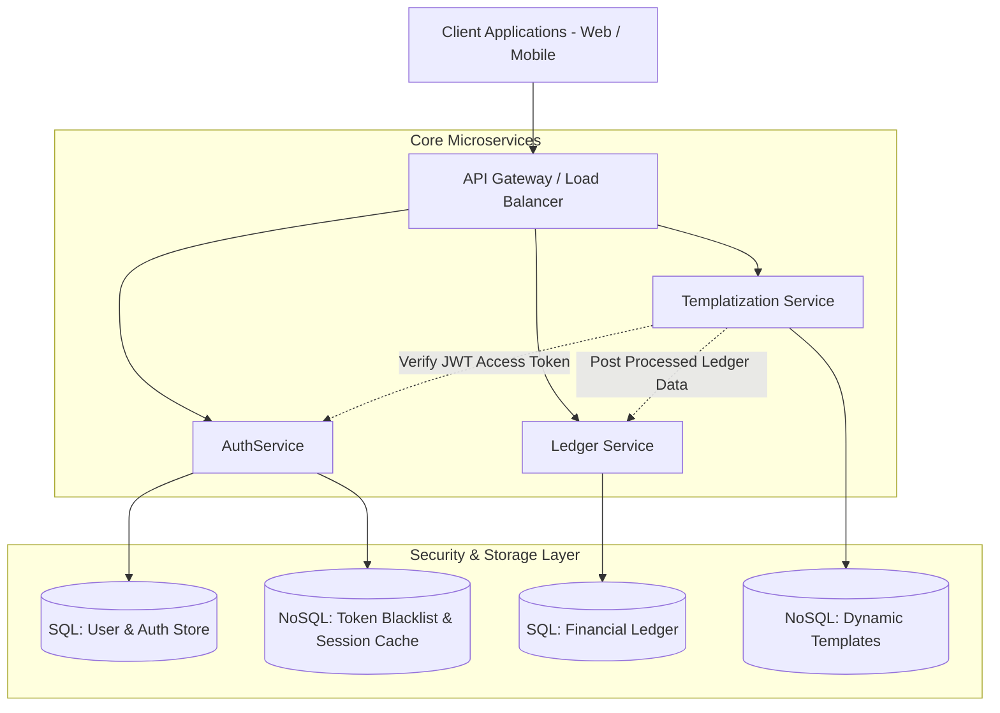

# Expense Tracker App - Global Microservices Platform

Welcome to the **Expense Tracker App** root repository. This project is a enterprise-grade, distributed microservices platform designed for high-scalability expense management, financial ledger tracking, role-based authorization, and dynamic templatized analytics reporting.

---

## 1. Global Repository Structure

```
ExpenseTracker/
├── Doc/                                    # Global Platform Documentation & Architecture Diagrams
│   ├── Doc_Index.md                        # Master Documentation Index & Developer Mapping Guide
│   ├── PRD_AuthService.md                  # Product Requirements Document for AuthService
│   ├── Auth_Architecture.md                # Authentication & Authorization Architectural Blueprint
│   ├── JWT_Authentication_LLD.md           # Low-Level Design, Sequence Diagrams & Filter Flows
│   └── Database_Architecture_SQL_vs_NoSQL.md # Polyglot Persistence Strategy (SQL vs NoSQL)
├── AuthService/                            # Microservice: Centralized Auth, JWT & User Management
│   ├── README.md                           # AuthService local build & configuration guide
│   └── ...                                 # AuthService codebase & local specs
└── README.md                               # Global Platform Overview (This File)
```

> [!NOTE]
> **Documentation Scope**: The `Doc/` folder in the root directory contains **global platform documentation**, system-wide architecture blueprints, database strategies, and cross-service sequence flows. Each microservice (such as [`AuthService`](file:///g:/My%20Drive/Projects/ExpenseTracker/AuthService/README.md)) contains its own service-specific `README.md` and configuration files.

---

## 2. Platform Architecture Overview

The Expense Tracker platform is built on a distributed microservices model with **Polyglot Persistence**:



---

## 3. Global Developer Documentation & Requirements Mapping

All core technical specifications, low-level design sequence diagrams, and requirements are organized into the root [`Doc/`](file:///g:/My%20Drive/Projects/ExpenseTracker/Doc/Doc_Index.md) directory:

| Architecture Area | File Link | Summary & Developer Mapping | Source / External Reference |
| :--- | :--- | :--- | :--- |
| **Master Index** | [`Doc/Doc_Index.md`](file:///g:/My%20Drive/Projects/ExpenseTracker/Doc/Doc_Index.md) | Centralized developer guide mapping all architecture specs, diagrams, and domain models. | Root Documentation Map |
| **AuthService PRD** | [`Doc/PRD_AuthService.md`](file:///g:/My%20Drive/Projects/ExpenseTracker/Doc/PRD_AuthService.md) | Comprehensive functional/non-functional requirements, user registration, JWT generation, and token lifecycle. | [Notion AuthService PRD](https://app.notion.com/p/Expense-Tracker-App-3b3f14429b7c80eeb3b4f34ee0882991?source=copy_link) |
| **Auth & Security Architecture** | [`Doc/Auth_Architecture.md`](file:///g:/My%20Drive/Projects/ExpenseTracker/Doc/Auth_Architecture.md) | Spring Security filters (`JWTAuthFilter`), `SecurityConfig`, `JWTService`, `UserDetailsServiceImpl`, `AuthenticationManager`. | [Excalidraw Auth Diagram](https://excalidraw.com/#json=Rs2pOoTxA7eUNRKviOhXH,MmcS5MI9bOGwhlONoULlgA) |
| **JWT LLD & Sequence Diagram** | [`Doc/JWT_Authentication_LLD.md`](file:///g:/My%20Drive/Projects/ExpenseTracker/Doc/JWT_Authentication_LLD.md) | Step-by-step sequence diagrams for login, request interception, token refresh rotation, and Templatization integration ($p_1$ placeholders). | [Excalidraw JWT LLD Diagram](https://excalidraw.com/#json=jf5EorV2iGUKGhuqwND4C,UYUXW1P3Gv3OGs54gWtF8w) |
| **Database Architecture** | [`Doc/Database_Architecture_SQL_vs_NoSQL.md`](file:///g:/My%20Drive/Projects/ExpenseTracker/Doc/Database_Architecture_SQL_vs_NoSQL.md) | Polyglot persistence selection rules comparing SQL (Auth & Ledger transactions) vs NoSQL (Redis token cache & MongoDB templates). | [Excalidraw SQL vs NoSQL Diagram](https://excalidraw.com/#json=Sce7Y7J3r-nrsXQ4sn4dq,bw9J63EjGK6PT2jGwGRhFA) |

---

## 4. Key Security & Microservice Concepts

1. **Stateless JWT Authentication**:
   - Access tokens are signed, short-lived (15 minutes), and verified statelessly by downstream microservices using public key / shared secret verification.
   - Intercepted by `JWTAuthFilter` before requests hit controllers.
2. **Refresh Token Rotation**:
   - Persistent long-lived refresh tokens stored securely in SQL database / Redis cache.
   - Rotated upon usage to mitigate replay attacks.
3. **Templatization & Dynamic Placeholder Binding**:
   - Downstream services evaluate spending categories dynamically:
     - `p1 -> Risk`: High budget variance.
     - `p1 -> Stable`: Within budget thresholds.
     - `p1 -> Not at all`: No financial activity detected.
4. **Database Selection Strategy**:
   - **SQL (PostgreSQL/MySQL)**: Used for `AuthService` user accounts/roles and financial ledgers where ACID compliance is mandatory.
   - **NoSQL (Redis/MongoDB)**: Used for session/token blacklists (Redis) and schemaless document templates (MongoDB).

---

## 5. Developer Onboarding & Quickstart

To work on microservices within this platform:
1. Review the master documentation index in [`Doc/Doc_Index.md`](file:///g:/My%20Drive/Projects/ExpenseTracker/Doc/Doc_Index.md).
2. For service-specific setup, navigate into the respective service directory:
   - [`AuthService`](file:///g:/My%20Drive/Projects/ExpenseTracker/AuthService/README.md) - Follow local instructions in `AuthService/README.md`.
3. Ensure local environment variables (database URIs, JWT secret keys, Redis hosts) are configured prior to starting services.

---

## 6. Guidelines for Contributing Documentation
- **Global / Cross-Cutting Changes**: Create or update documents inside `Doc/` and update [`README.md`](file:///g:/My%20Drive/Projects/ExpenseTracker/README.md) and [`Doc/Doc_Index.md`](file:///g:/My%20Drive/Projects/ExpenseTracker/Doc/Doc_Index.md).
- **Service-Specific Changes**: Keep modifications within the microservice's directory (e.g. `AuthService/`). Do not clutter global docs with service internal implementation logs.
