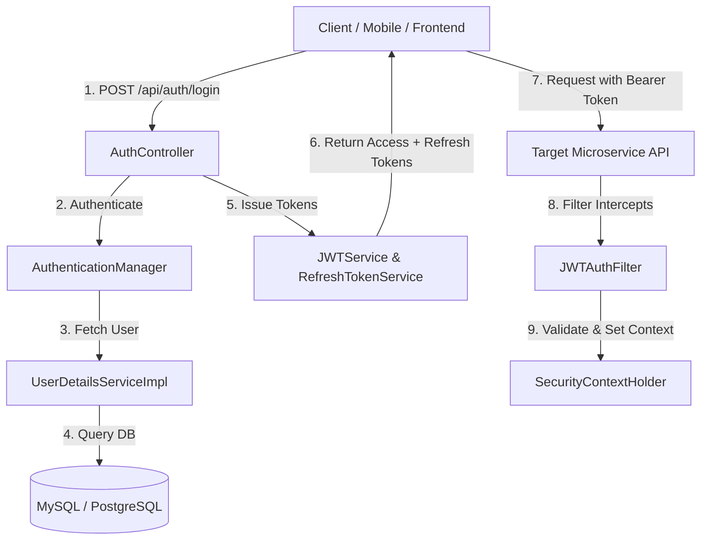

# Authentication & Authorization Architecture

## 1. Executive Summary
This document defines the high-level authentication and authorization architecture for the **Expense Tracker App**. It outlines the core concepts, security boundaries, component responsibilities, and request flows between the user client, the `AuthService`, and downstream microservices.

- **Primary Reference**: [Excalidraw Diagram - Authentication & Authorization](https://excalidraw.com/#json=Rs2pOoTxA7eUNRKviOhXH,MmcS5MI9bOGwhlONoULlgA)
- **Scope**: Platform-wide security model

---

## 2. Core Concepts & Separation of Concerns

```
+-----------------------------------------------------------------------+
|                            USER / CLIENT                              |
+-----------------------------------------------------------------------+
               |                                       |
    [1] Login (Credentials)             [2] API Call (Bearer JWT Token)
               v                                       v
+-----------------------------+         +-------------------------------+
|         AuthService         |         |     Downstream Microservice   |
|  - Validates Credentials    |         |     (e.g., Ledger, Template)  |
|  - Issues Access & Refresh  |         |  - Validates JWT via Filter   |
|    Tokens                   |         |  - Enforces Role Permissions  |
+-----------------------------+         +-------------------------------+
```

### 2.1 Authentication ("Who are you?")
Authentication is the process of verifying a user's identity.
- Users provide credentials (`email` + `password`).
- `AuthService` verifies credentials against the secure database.
- Upon successful authentication, `AuthService` issues a dual-token pair:
  - **Access Token**: Short-lived (15 minutes), stateless JWT token signed by secret key.
  - **Refresh Token**: Long-lived (7 days), stored securely in database/Redis.

### 2.2 Authorization ("What are you allowed to do?")
Authorization determines whether an authenticated user has permission to access a specific resource or perform an action.
- Every protected endpoint in Expense Tracker requires a valid JWT Access Token passed via HTTP Header: `Authorization: Bearer <accessToken>`.
- Security filters (`JWTAuthFilter`) inspect token claims and inject granted authorities (`ROLE_USER`, `ROLE_ADMIN`) into the security context (`SecurityContextHolder`).
- Fine-grained access control is applied at controller methods (e.g., `@PreAuthorize("hasRole('ADMIN')")`).

---

## 3. Core Spring Security Components & Classes

| Component Name | Type / Interface | Description & Responsibility |
| :--- | :--- | :--- |
| `SecurityConfig` | Configuration Class | Configures Spring Security filter chains, CORS/CSRF rules, password encoders, and route permit lists. |
| `JWTAuthFilter` | `OncePerRequestFilter` | Intercepts all incoming requests, extracts Bearer token, validates signature/expiration, and populates `SecurityContext`. |
| `AuthController` | Controller Endpoint | Exposes REST APIs for user registration, authentication, token refresh, and logout. |
| `TokenController` | Controller Endpoint | Handles auxiliary token management APIs (token introspection, details extraction). |
| `JWTService` | Utility Service | Encapsulates token generation, claims parsing, signature verification, and expiration checks. |
| `RefreshTokenService` | Business Service | Manages creation, database persistence, verification, and rotation of Refresh Tokens. |
| `UserDetailsServiceImpl` | `UserDetailsService` | Implements user lookup from database for Spring Security authentication manager. |
| `AuthenticationManager` | Spring Core Bean | Orchestrates credential authentication against configured user details services and password encoders. |
| `EventPublisher` | Application Event Publisher | Publishes domain security events (e.g. `UserLoginEvent`, `AuthFailureEvent`) for auditing and notification systems. |

---

## 4. Key Security Rules & Decisions
1. **Stateless Sessions**: Server session storage (`HttpSession`) is completely disabled (`SessionCreationPolicy.STATELESS`).
2. **CSRF Protection**: Disabled for REST APIs using stateless JWT authentication.
3. **CORS Policy**: Restrictive cross-origin resource sharing configured globally for client web/mobile applications.
4. **Password Hashing**: BCrypt algorithm with configurable salt strength.
5. **Secret Management**: JWT signing keys and database connection strings are injected via environment variables (never hardcoded).

---

## 5. Developer Mapping Matrix



| Field Name | Source | Destination | Purpose |
| :--- | :--- | :--- | :--- |
| `Authorization` | HTTP Header | `JWTAuthFilter` | Contains `Bearer <accessToken>` |
| `sub` | JWT Payload | `SecurityContext` | User Identifier / Email |
| `roles` | JWT Payload | `SecurityContext` | Granted Authorities for RBAC |
| `refreshToken` | HTTP Cookie / Body | `RefreshTokenService` | Rotates expired access tokens |
