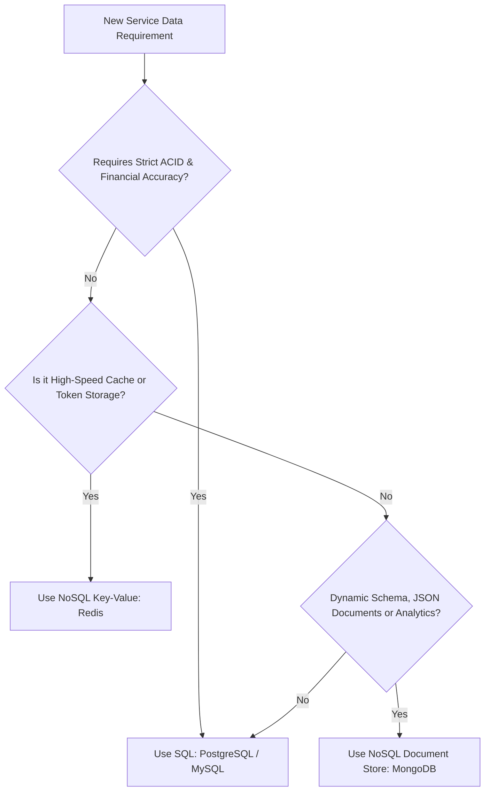

# Database Architecture: SQL vs. NoSQL Strategy

## 1. Executive Summary
The **Expense Tracker App** employs a **Polyglot Persistence Architecture**, selecting database technologies based on the specific data storage, transaction integrity, query patterns, and throughput requirements of each microservice.

- **Primary Reference**: [Excalidraw Diagram - SQL and NoSQL Architecture](https://excalidraw.com/#json=Sce7Y7J3r-nrsXQ4sn4dq,bw9J63EjGK6PT2jGwGRhFA)
- **Scope**: Platform-wide database design strategy

---

## 2. SQL vs. NoSQL Architectural Comparison

```
+-------------------------------------------------------------------------------+
|                       EXPENSE TRACKER PERSISTENCE LAYER                       |
+-------------------------------------------------------------------------------+
                       |                               |
        +--------------+--------------+ +--------------+--------------+
        |   RELATIONAL STORE (SQL)    | |     NOSQL STORE (KEY-VAL/DOC) |
        |  PostgreSQL / MySQL         | |  Redis / MongoDB            |
        +-----------------------------+ +-----------------------------+
        | - AuthService User Store    | | - JWT Blacklist & Sessions  |
        | - Ledger Transaction Store  | | - Templatization Service    |
        | - ACID Compliance Required  | | - High Throughput & Schemaless|
        +-----------------------------+ +-----------------------------+
```

| Criteria | Relational Database (SQL) | Non-Relational Database (NoSQL) |
| :--- | :--- | :--- |
| **Data Structure** | Structured Tables with Rows & Columns | Key-Value Pairs, JSON Documents, Column-Family |
| **Schema** | Fixed, Strictly Enforced Schema | Flexible / Dynamic / Schemaless |
| **ACID Guarantees** | Strong Atomicity, Consistency, Isolation, Durability | Eventual Consistency (BASE), Tunable Consistency |
| **Scaling** | Vertical (Scale-Up), Read Replicas | Horizontal (Scale-Out Sharding across nodes) |
| **Best For** | Transactional ledgers, User credentials, Complex JOINs | Session cache, Token blacklists, Dynamic templates, Logs |
| **Expense Tracker Usage** | `AuthService`, `Ledger Service` | `Redis` (Auth Cache), `Templatization Service` |

---

## 3. Microservice Storage Mapping

### 3.1 AuthService: Relational SQL Store (PostgreSQL / MySQL)
`AuthService` mandates strict consistency, foreign key constraints, and ACID transactions for account creation and credential management.

#### Entity Relationship (ER) Schema Overview:
- **`users` Table**:
  - `id` (BIGINT / UUID, PRIMARY KEY)
  - `email` (VARCHAR(255), UNIQUE, NOT NULL)
  - `password_hash` (VARCHAR(255), NOT NULL)
  - `first_name` (VARCHAR(100))
  - `last_name` (VARCHAR(100))
  - `created_at` (TIMESTAMP), `updated_at` (TIMESTAMP)

- **`roles` Table**:
  - `id` (INT, PRIMARY KEY)
  - `name` (VARCHAR(50), UNIQUE) e.g., `ROLE_USER`, `ROLE_ADMIN`

- **`user_roles` Join Table**:
  - `user_id` (FOREIGN KEY -> `users.id`)
  - `role_id` (FOREIGN KEY -> `roles.id`)

- **`refresh_tokens` Table**:
  - `id` (BIGINT, PRIMARY KEY)
  - `user_id` (FOREIGN KEY -> `users.id`)
  - `token` (VARCHAR(512), UNIQUE, NOT NULL)
  - `expiry_date` (TIMESTAMP, NOT NULL)
  - `revoked` (BOOLEAN, DEFAULT FALSE)

---

### 3.2 AuthService & Gateway Cache: NoSQL Key-Value Store (Redis)
High-frequency authentication lookup operations require low-latency in-memory storage.

- **Use Cases**:
  1. **JWT Access Token Blacklist**: Revoked access tokens stored with TTL matching token expiry (`token_jti -> "blacklisted"`).
  2. **Session / Refresh Token Cache**: Quick lookup for active user sessions.
  3. **Rate Limiting Counter**: Fixed-window or sliding-window rate limit counters per IP/user (`rate:login:ip -> count`).

---

### 3.3 Templatization Service: NoSQL Document Store (MongoDB)
The `Templatization Service` processes dynamic notifications, category rules, and spending template layouts with variable schema requirements.

- **Document Structure (`spending_templates`)**:
```json
{
  "_id": "tpl_987654321",
  "templateName": "Monthly_Spending_Report",
  "version": "1.2.0",
  "placeholders": [
    {
      "key": "p1",
      "type": "CATEGORY_EVALUATION",
      "rules": [
        { "condition": "spending > budget * 1.2", "result": "Risk" },
        { "condition": "spending <= budget", "result": "Stable" },
        { "condition": "spending == 0", "result": "Not at all" }
      ]
    }
  ],
  "contentLayout": "<h1>Spending Analysis</h1><p>{{p1}}</p>",
  "updatedAt": "2026-09-19T15:51:00Z"
}
```

---

## 4. Decision Matrix for Future Developers

When building a new microservice in the Expense Tracker ecosystem, select the database engine according to this decision guide:


