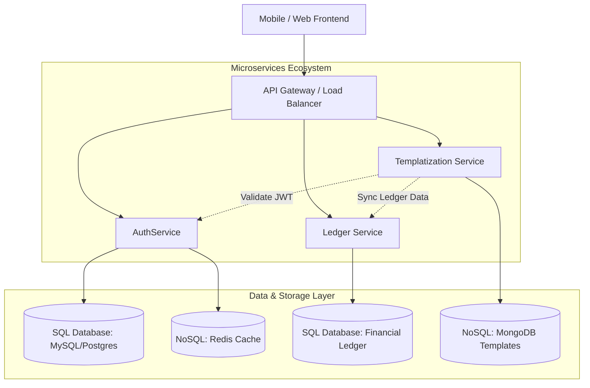

# Global Developer Documentation Index & Architecture Map

## 1. Welcome to Expense Tracker Documentation
This document serves as the primary entry point and mapping directory for developers working on the **Expense Tracker App** global repository.

It centralizes links, descriptions, domain models, sequence flows, and system designs to ensure smooth onboarding and consistent architectural practices across microservices.

---

## 2. Global Documentation Directory (`Doc/`)

| Document Name | Description | Key Architectural Topics Covered | External / Source Reference |
| :--- | :--- | :--- | :--- |
| [`PRD_AuthService.md`](file:///g:/My%20Drive/Projects/ExpenseTracker/Doc/PRD_AuthService.md) | Product Requirements Document for AuthService | Objectives, User Registration, Login, Token Refresh, Revocation, RBAC | [Notion AuthService PRD](https://app.notion.com/p/Expense-Tracker-App-3b3f14429b7c80eeb3b4f34ee0882991?source=copy_link) |
| [`Auth_Architecture.md`](file:///g:/My%20Drive/Projects/ExpenseTracker/Doc/Auth_Architecture.md) | Authentication & Authorization High-Level Design | Spring Security filters (`JWTAuthFilter`), `SecurityConfig`, `JWTService`, `UserDetailsServiceImpl`, `AuthenticationManager` | [Excalidraw Auth Diagram](https://excalidraw.com/#json=Rs2pOoTxA7eUNRKviOhXH,MmcS5MI9bOGwhlONoULlgA) |
| [`JWT_Authentication_LLD.md`](file:///g:/My%20Drive/Projects/ExpenseTracker/Doc/JWT_Authentication_LLD.md) | Low-Level Design & Sequence Flows | Login Sequence, Token Interception, Refresh Token Rotation, Templatization Service Integration & Placeholder Binding | [Excalidraw JWT LLD Diagram](https://excalidraw.com/#json=jf5EorV2iGUKGhuqwND4C,UYUXW1P3Gv3OGs54gWtF8w) |
| [`Database_Architecture_SQL_vs_NoSQL.md`](file:///g:/My%20Drive/Projects/ExpenseTracker/Doc/Database_Architecture_SQL_vs_NoSQL.md) | Storage Strategy & Schema Comparison | Relational SQL (Auth & Ledger) vs NoSQL (Redis Session & MongoDB Templatization), Polyglot persistence guidelines | [Excalidraw SQL vs NoSQL Diagram](https://excalidraw.com/#json=Sce7Y7J3r-nrsXQ4sn4dq,bw9J63EjGK6PT2jGwGRhFA) |

---

## 3. Global Architecture Map

---

## 4. Microservice Documentation Convention
Each microservice in the global `ExpenseTracker` project maintains its own isolated codebase and service-specific documentation:

- **Global Documentation**: `ExpenseTracker/Doc/` (Cross-cutting architecture, platform PRDs, global diagrams)
- **Service Documentation**: `<MicroserviceName>/` (e.g. `AuthService/README.md`, localized API specs, build guides)

> [!IMPORTANT]
> **Developer Rule**: When modifying global system architecture or cross-cutting microservice flows, update the documents in `ExpenseTracker/Doc/`. Service-specific implementation details must stay inside their respective service directories (e.g., `AuthService/`).

---

## 5. Quick Links & Resources
- **Global Project README**: [`README.md`](file:///g:/My%20Drive/Projects/ExpenseTracker/README.md)
- **AuthService PRD**: [`PRD_AuthService.md`](file:///g:/My%20Drive/Projects/ExpenseTracker/Doc/PRD_AuthService.md)
- **Authentication Design**: [`Auth_Architecture.md`](file:///g:/My%20Drive/Projects/ExpenseTracker/Doc/Auth_Architecture.md)
- **JWT LLD Sequence Diagram**: [`JWT_Authentication_LLD.md`](file:///g:/My%20Drive/Projects/ExpenseTracker/Doc/JWT_Authentication_LLD.md)
- **SQL vs NoSQL Strategy**: [`Database_Architecture_SQL_vs_NoSQL.md`](file:///g:/My%20Drive/Projects/ExpenseTracker/Doc/Database_Architecture_SQL_vs_NoSQL.md)
