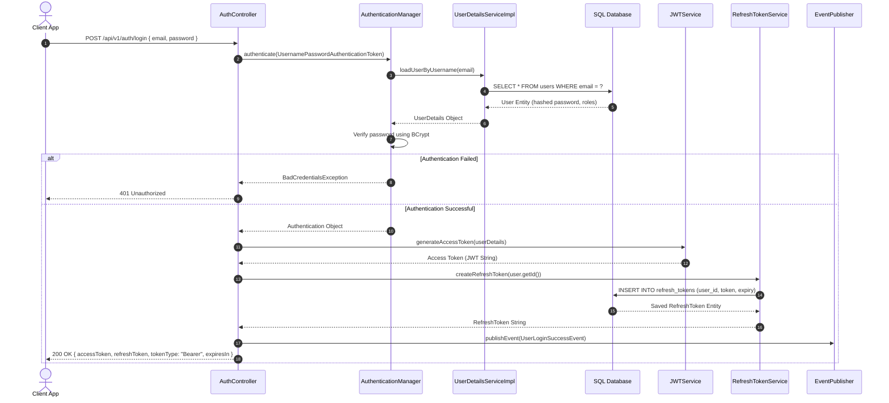
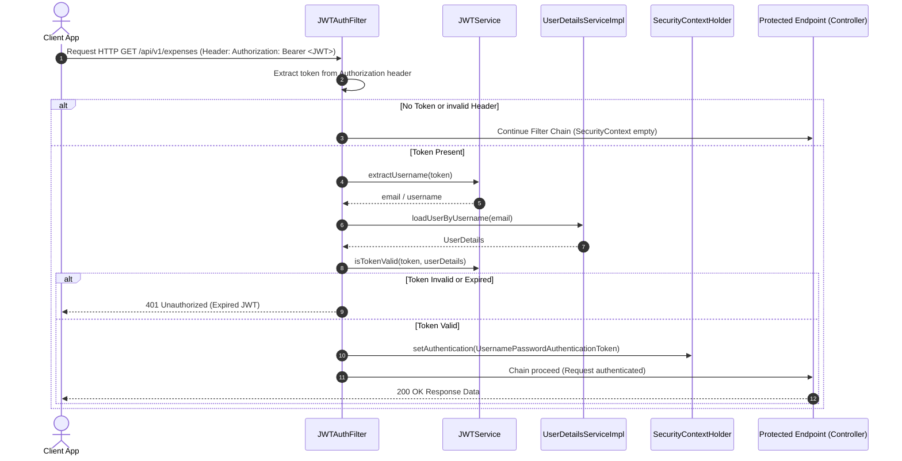
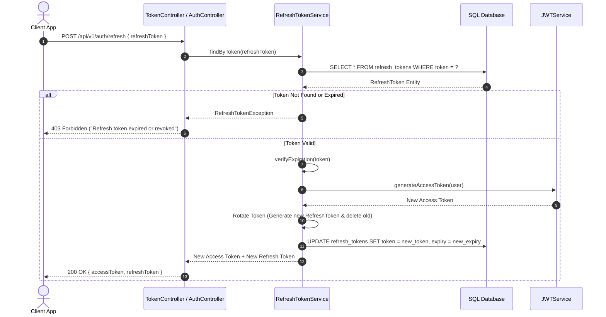
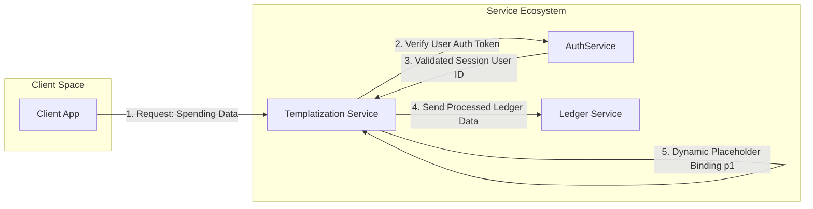

# JWT Authentication Low-Level Design (LLD) & Sequence Diagram

## 1. Overview
This Low-Level Design (LLD) document provides a step-by-step technical breakdown of the JSON Web Token (JWT) lifecycle, class interactions, execution sequence, and cross-microservice integration within the **Expense Tracker App**.

- **Primary Reference**: [Excalidraw Diagram - JWT Auth LLD & Templatization Flow](https://excalidraw.com/#json=jf5EorV2iGUKGhuqwND4C,UYUXW1P3Gv3OGs54gWtF8w)
- **Target Audience**: Backend Developers, Integration Engineers

---

## 2. Low-Level Component Interactions

### 2.1 Sequence Diagram: Login & Token Issuance

---

### 2.2 Sequence Diagram: Request Interception & Token Validation

---

### 2.3 Sequence Diagram: Refresh Token Rotation Flow

---

## 3. Microservice Integration: Templatization & Ledger Service Flow

As shown in the architecture diagrams, downstream services interact with `AuthService` and consume user context dynamically:

### 3.1 Dynamic Template Placeholder Binding Mechanics
- **Trigger**: Client requests a template output (e.g. spending notification report).
- **Backend Placeholder Payload**:
  $$\text{Placeholder } p_1 = \{\text{ spending\_category\_evaluation }\trunk\}$$
- **Evaluated Categories**:
  - `-> Risk`: High budget variance / abnormal spending.
  - `-> Stable`: Within allocated budget limits.
  - `-> Not at all`: No activity detected.
- **Output**: Templatization Service binds $p_1$ dynamically and passes the formatted payload to destination services (e.g., Notification Service, Email Gateway, Ledger Service).

---

## 4. Class & Method Mapping Specification

| Service / Class | Method Signature | Input Parameters | Output / Return Type | Purpose |
| :--- | :--- | :--- | :--- | :--- |
| `JWTService` | `generateToken(UserDetails userDetails)` | `UserDetails` | `String` (JWT) | Generates signed 15-minute access token |
| `JWTService` | `extractUsername(String token)` | `String` | `String` | Extracts `sub` claim (user email) |
| `JWTService` | `isTokenValid(String token, UserDetails userDetails)` | `String`, `UserDetails` | `boolean` | Verifies signature & expiration timestamp |
| `RefreshTokenService` | `createRefreshToken(Long userId)` | `Long` | `RefreshToken` | Creates & persists refresh token in DB |
| `RefreshTokenService` | `verifyExpiration(RefreshToken token)` | `RefreshToken` | `RefreshToken` | Checks if refresh token is past `expiryDate` |
| `JWTAuthFilter` | `doFilterInternal(...)` | `HttpServletRequest`, `HttpServletResponse`, `FilterChain` | `void` | Intercepts HTTP request & sets security context |
